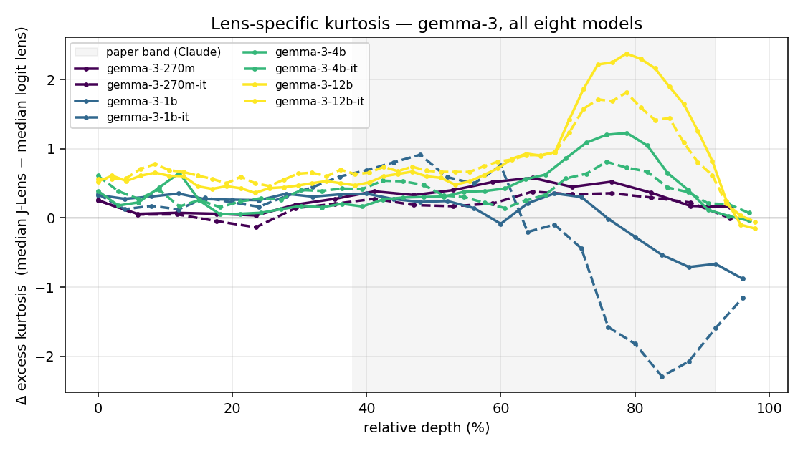
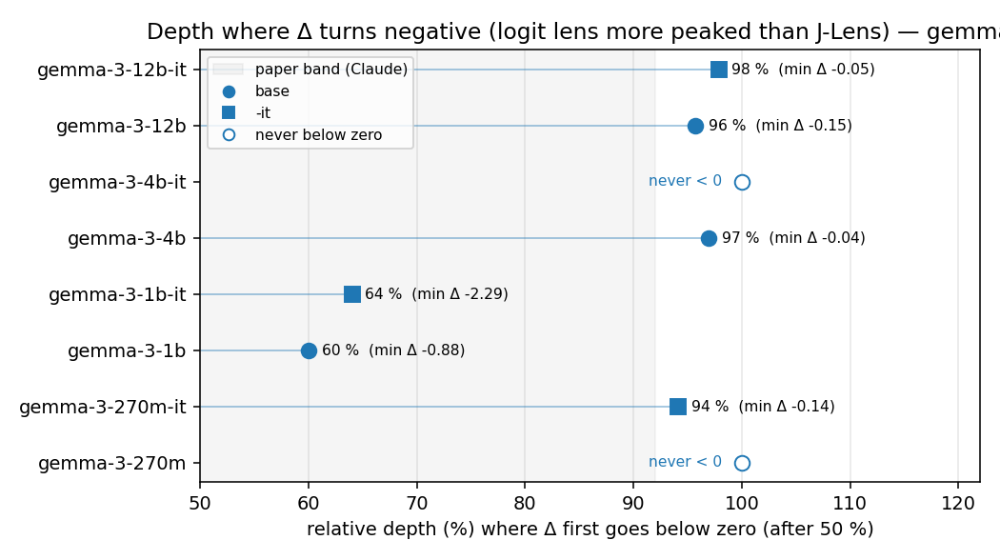
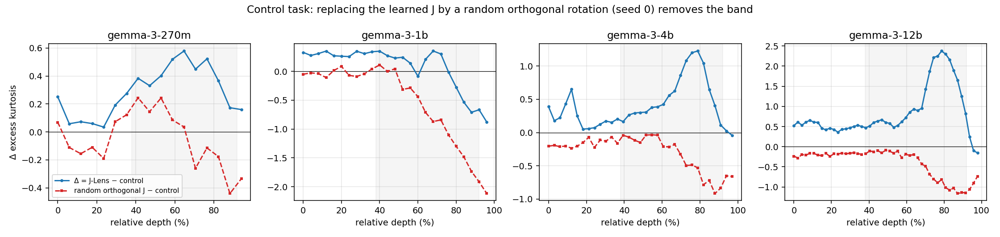
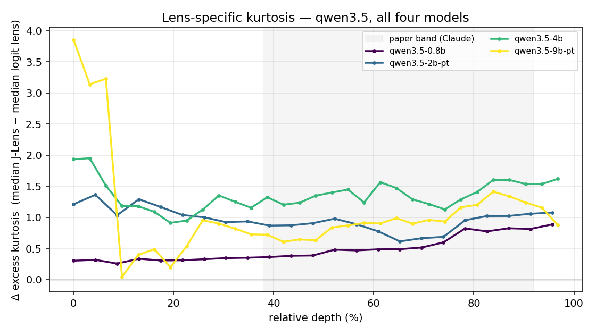
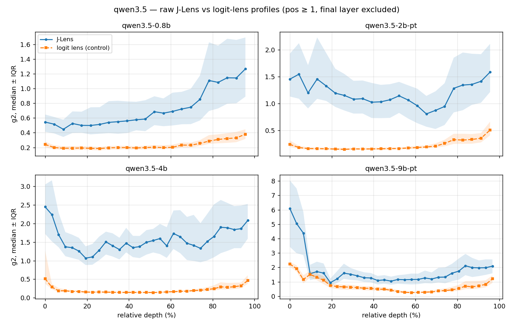
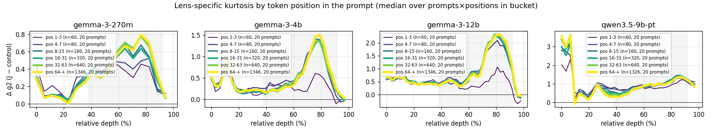

# A lens-specific kurtosis signature emerges with scale in gemma-3 and not in qwen3.5

## Executive summary

Does the lens-specific kurtosis band reported in (2) on Claude exist in small open models, and does it grow with scale?

Method: I defined a measure: Δ = median J-lens kurtosis minus median logit-lens kurtosis, per layer. I Ran it on 12 models, gemma-3 `270m` to `12b` base and `-it`, qwen3.5 `0.8b` to `9b` using pre-fitted registry lenses, 20 prompts on all positions ≥ 1.

Results:

- Signature emerges with size on gemma-3: absent at `1b`, bump 1.0 at `4b` and bump 1.9 at `12b`.
- The band opens later than in the paper, 60–64 % against 38 %, peaks at 76–79 %, then reaches the motor regime at 96–98 % as in the paper.
- No signature detected in any evaluated qwen3.5: no band up to `9b`; the profile drifts up in the last third and never closes; whether this is family or size cannot be decided at these sizes.
- Position: model behavior is stable from position 4 up to 150 tokens, in both families.

Control by random orthogonal rotation correctly removed the band at all four scales as expected before the run.

This is not a claim about existence of a global workspace but an exploration of the emergence of the described signature.

## Key Experiments

Verbalizable Representations Form a Global Workspace in LMs (Gurnee et al., 2026) (2) reports the existence of a characteristic band, which the paper reads as the J-space, on Claude. The question is whether a lens-specific signature exists in small open models, whether it grows with scale inside one family, and whether it holds across families.

### What are we measuring? The three arms

Following definition in (2), a "delta" indicator has been defined using J-lens and logit lens this way:

- A J-lens arm, called J, uses J-lens profile defined in (2):
  - g2 is the biased plug-in estimator m4/m2² − 3, computed on the logits of the readout over the full vocabulary, for each layer, prompt and position, in float64. At n ≈ 250k the finite-sample bias is negligible.
  - Figures show g2 median ± IQR across prompts × positions using relative depth [0–100] for x-axis.
  - g2 is a normalized moment, so comparing across vocab sizes is fine at these sample sizes.
- A control arm, called C: the logit-lens run through the same code path. It gives the readout without transport, so C is the identity baseline.
- The Delta arm, using J-C median per layer : Δ = median(J) − median(C) per layer, over positions ≥ 1, final layer (identical in J and C arms) excluded.

Idea of the delta arm comes from a discussion with @SanjidMzi on issue [TransformerLens#1539](https://github.com/TransformerLensOrg/TransformerLens/issues/1539#issuecomment-5125470520): "What does J-lens arm measure add to identity measure?". Δ isolates what the fitted J adds over identity.

### Models and lenses

Gemma 3 offers the broadest model size scale in the same family with pre-fitted lenses. This distribution allows to look where the signal could emerge. I decided to test with `270m`, `1b`, `4b` and `12b`, in `base` and `-it` version, that I could run locally and leave `27b` for post submission tests on an external pod. I did not find any prior J-space measurement on gemma-3 kurtosis.

Behavior described in (2) has been reproduced in (3) on `Qwen3.6 27b`. Since `Qwen3.6` is not available in smaller models I went to `Qwen3.5`, `0.8b`, `2b`, `4b` and `9b`. Test on `27b` is also planned post submission.

Lenses used are pre-fitted lenses from registry (TransformerLens tools.analysis.jacobian_lens + its jacobian_lens_registry.json). Experiment is then a readout over the model's full vocabulary (262 144 for gemma `270m` and `1b`, 262 208 for larger gemma, 248 320 for Qwen models), calculation of g2 and control value (logit lens estimator) in float64 on 20 prompts.

**Table 1 — Models and lenses.** All lenses are the pre-fitted ones from the TransformerLens registry; the checkpoint stage is the one the registry lens was fitted on. Readout over the full vocabulary. 20 prompts, 300 (gemma) / 279 (qwen) readout positions ≥ 1.

| model | HF checkpoint | stage | layers | d_model | vocab | dtype |
|---|---|---|---|---|---|---|
| `gemma-3-270m` | google/gemma-3-270m | base | 18 | 640 | 262 144 | float32 |
| `gemma-3-270m-it` | google/gemma-3-270m-it | instruction-tuned | 18 | 640 | 262 144 | float32 |
| `gemma-3-1b` | google/gemma-3-1b-pt | base | 26 | 1152 | 262 144 | bfloat16 |
| `gemma-3-1b-it` | google/gemma-3-1b-it | instruction-tuned | 26 | 1152 | 262 144 | bfloat16 |
| `gemma-3-4b` | google/gemma-3-4b-pt | base | 34 | 2560 | 262 208 | bfloat16 |
| `gemma-3-4b-it` | google/gemma-3-4b-it | instruction-tuned | 34 | 2560 | 262 208 | bfloat16 |
| `gemma-3-12b` | google/gemma-3-12b-pt | base | 48 | 3840 | 262 208 | bfloat16 |
| `gemma-3-12b-it` | google/gemma-3-12b-it | instruction-tuned | 48 | 3840 | 262 208 | bfloat16 |
| `qwen3.5-0.8b` | Qwen/Qwen3.5-0.8B | post-trained | 24 | 1024 | 248 320 | bfloat16 |
| `qwen3.5-2b-pt` | Qwen/Qwen3.5-2B-Base | base | 24 | 2048 | 248 320 | bfloat16 |
| `qwen3.5-4b` | Qwen/Qwen3.5-4B | post-trained | 32 | 2560 | 248 320 | bfloat16 |
| `qwen3.5-9b-pt` | Qwen/Qwen3.5-9B-Base | base | 32 | 4096 | 248 320 | bfloat16 |

### Prompt length

A second measure on prompt length axis with same estimators on 20 prompts from 110 to 158 tokens to check evolution of signature on later positions. Ran on 5 models : gemma-3 `270m`/`4b`/`4b-it`/`12b` + `qwen3.5-9b-pt`. File `prompts_long.txt` available in the repository.

### Sanity checks

- g2 implementation was checked on synthetic samples of the same shape as the readout (8 × 262 144): Gaussian +0.008, Laplace 2.98, uniform −1.20, against exact values 0, 3, −1.2. Expected tolerance: ±0.02 Gaussian, ±0.1 Laplace. (in `check_estimator.py`)
- The measurement involves no sampling; the random-rotation control arm is seeded (seed 0). A full re-run of the `gemma-3-270m` sweep reproduced the stored JSON bit-exactly.

#### Random orthogonal control

This is a control task in the spirit of Hewitt & Liang 2019: replace J layer by layer by a random orthogonal rotation, QR of a Gaussian with seed 0. Readout code path, 20-prompts set and estimator are the ones used in the experiment. Run on `270m`, `1b`, `4b`, `12b` base checkpoints.

The goal: separate the learned structure of J from "any matrix in front of the unembedding". Norms are preserved by isometry and the readout normalises anyway, so this arm tests structure, not scale.

Prediction recorded before the run: the bump must vanish.

### Code and data

Public repository: [https://github.com/rbellec/tiny_interpretability_lab/tree/main/experiments/jacobian-lens-scale](https://github.com/rbellec/tiny_interpretability_lab/tree/main/experiments/jacobian-lens-scale). Files referred to in this document:

- [`sweep_kurtosis.py`](https://github.com/rbellec/tiny_interpretability_lab/blob/main/experiments/jacobian-lens-scale/sweep_kurtosis.py) — J-lens and logit-lens arms, g2 estimator (`excess_kurtosis`), writes `results/kurtosis_<model>.json`
- [`sweep_control_task.py`](https://github.com/rbellec/tiny_interpretability_lab/blob/main/experiments/jacobian-lens-scale/sweep_control_task.py) — random orthogonal arm (seed 0), writes `results/kurtosis_random_<model>.json`
- [`check_estimator.py`](https://github.com/rbellec/tiny_interpretability_lab/blob/main/experiments/jacobian-lens-scale/check_estimator.py) — g2 check on Gaussian / Laplace / uniform samples
- [`prompts.txt`](https://github.com/rbellec/tiny_interpretability_lab/blob/main/experiments/jacobian-lens-scale/prompts.txt) (20 prompts, 6–28 tokens) and [`prompts_long.txt`](https://github.com/rbellec/tiny_interpretability_lab/blob/main/experiments/jacobian-lens-scale/prompts_long.txt) (20 prompts, 110–158 tokens)
- [`plot_diff_position.py`](https://github.com/rbellec/tiny_interpretability_lab/blob/main/experiments/jacobian-lens-scale/plot_diff_position.py) — Δ profiles, prompt-bootstrap CI, position buckets, heatmaps; [`plot_overlay.py`](https://github.com/rbellec/tiny_interpretability_lab/blob/main/experiments/jacobian-lens-scale/plot_overlay.py), [`plot_motor_onset.py`](https://github.com/rbellec/tiny_interpretability_lab/blob/main/experiments/jacobian-lens-scale/plot_motor_onset.py), [`plot_random_arm.py`](https://github.com/rbellec/tiny_interpretability_lab/blob/main/experiments/jacobian-lens-scale/plot_random_arm.py), [`plot_raw_clean.py`](https://github.com/rbellec/tiny_interpretability_lab/blob/main/experiments/jacobian-lens-scale/plot_raw_clean.py) — the figures of this document
- [`results/`](https://github.com/rbellec/tiny_interpretability_lab/tree/main/experiments/jacobian-lens-scale/results) — one JSON per model and arm (all g2 values, metadata: checkpoint, dtype, layers, vocab, prompt file); [`figures/`](https://github.com/rbellec/tiny_interpretability_lab/tree/main/experiments/jacobian-lens-scale/figures)

## Results

Gemma models exhibit an emergence of the signature with scale where the Qwen3.5 models used did not show any related behavior.

### Gemma-3 results

#### Signature emergence according to model size

As shown in Figure 1, signature bump grows monotonically with scale since `4b` model size: `270m` ≈ 0.25, `4b` ≈ 1.0, `12b` ≈ 1.9, peak at ~76-79 %. It's absent from `1b` and `1b-it`. `1b` rises at 60 % in both arms, so Δ stays flat. `1b-it` shows a bump above the logit lens at 36–60 % on the raw profile; in Δ it is 0.16, CI touching zero, 12/20 prompts, visible on the median and not reproducible across prompts.

**Table 2 — Gemma-3, Δ = median(J-lens) − median(logit lens) per layer.** Baseline = median Δ over 25–55 % depth; peak = max Δ over 55–95 %; bump = peak − baseline; 95 % CI by bootstrap over prompts; "prompts > 0" = prompts whose own bump is positive. Band onset = first depth ≥ 25 % where Δ > baseline + 0.3. Motor onset = first depth after 50 % where Δ < 0. Positions ≥ 1, final layer excluded.

| model | layers | baseline | peak @ depth | bump | 95 % CI | prompts > 0 | band onset | motor onset |
|---|---|---|---|---|---|---|---|---|
| `270m` | 18 | 0.33 | 0.58 @ 65 % | 0.25 | [0.14 ; 0.37] | 20/20 | — | never |
| `270m-it` | 18 | 0.19 | 0.38 @ 65 % | 0.19 | [0.12 ; 0.30] | 20/20 | — | 94 % (−0.14) |
| `1b` | 26 | 0.31 | 0.35 @ 68 % | 0.05 | [−0.23 ; 0.30] | 13/20 | — | 60 % |
| `1b-it` | 26 | 0.60 | 0.75 @ 60 % | 0.16 | [−0.00 ; 0.29] | 12/20 | 48 % | 64 % |
| `4b` | 34 | 0.23 | 1.23 @ 79 % | 0.99 | [0.79 ; 1.27] | 20/20 | 64 % | 97 % |
| `4b-it` | 34 | 0.41 | 0.81 @ 76 % | 0.40 | [0.24 ; 0.55] | 19/20 | 76 % | never |
| `12b` | 48 | 0.51 | 2.37 @ 79 % | 1.87 | [1.58 ; 2.17] | 20/20 | 62 % | 96 % |
| `12b-it` | 48 | 0.66 | 1.81 @ 79 % | 1.15 | [0.90 ; 1.37] | 20/20 | 70 % | 98 % |

`4b-it` model has two bumps on 18/20 prompts and shows a unique behavior not found in other tests. This observation is robust and I have no interpretation.

The bump on `270m` is consistent but weak: a wide, low bell going from 0.05 to 0.58 and back to 0.17. I do not treat it as load-bearing but the question remains open.

In models displaying the signature, the band opens much later than in (2), between 60% and 64% of layer depth compared to 38% on Claude. Elie Bak locates the band boundary with relative depth ρ ≈ 0.63-0.67 across 38 models. Peak (~78%) and end (92%) stay inside the 38%-92% described in (2). "Motor regime" (where delta becomes negative) starts between 96-98%, which coincides with the 92-100% described in (2). I have no explanation for the later onset.

#### Negative Δ and the motor regime

Negative delta (J-lens - Logit lens) may indicate the beginning of "motor regime" and starts earlier in small models. Under zero at `1b` 60 %, `1b-it` 64 %, `4b` 97 %, `12b` 96 %, `12b-it` 98 %. `270m` and `4b-it` never go below zero; `270m-it` only marginally (−0.14 at 94 %). Hypothesis (not verified): in that regime the logit lens already reads the model's final distribution, which is more peaked than what transport through the prompt-averaged Jacobian yields.

Considering `-it` vs base models, `-it` models display a smaller amplitude and earlier rising of control. No reference about this was found in the papers nor by Elie Bak.

### Random orthogonal arm

We observe that the random orthogonal arm removes the band at four scales. On `270m` the random arm is not flat and has a small bump of 0.25 around 40-55 %. Not located where the delta bump sits (65 %), but with the same order of magnitude. This is one more reason not to make `270m` load-bearing but I could not investigate more this specific behavior.

| model | peak Δ(J−C), 55–95 % depth | peak Δ(R−C), same window |
|---|---|---|
| `270m` | 0.58 | 0.08 |
| `1b` | 0.35 | −0.29 |
| `4b` | 1.23 | −0.04 |
| `12b` | 2.37 | −0.11 |

(J = fitted Jacobian lens, R = random orthogonal rotation, C = logit-lens control. Peak = max of the per-layer median Δ, positions ≥ 1, final layer excluded.)

This control shows that the band needs the learned structure of J and that `4b`/`12b` is not an artefact of the transport itself. It does not show that this structure is "the workspace" and says nothing about the band position. A stronger null exists: a J fitted on shuffled data, not done.

### Qwen3.5 results

Qwen3.5 models tested are `0.8b`, `2b`, `4b` and `9b`. None of the four shows a band, the J-lens profile drifts up in the last third and does not come back down before the final layer. An input spike at layer 0 appears in both arms on `4b` and `9b`, so it comes from the residual stream, not from the lens. I do not have an interpretation of these shapes. The test on `Qwen 3.5 27B` called for by (3) could not be done under the time cap; planned after submission, result in appendix.

I referred to the J-lens and logit-lens figures to get more insight:

- J-lens rises over the last third in all four.
- Control is flat till last layers, with a narrow IQR on `0.8b`, `2b` and `4b`. `9b` displays an initial decrease from 2.2 to 0.25 around 60 % then grows. Decrease of delta on the later range is explained by increase of control and not a conjoint decrease of J.
- The Δ bump on `9b` is J-lens rising from 75 % then control rising after 84 %, neither returns to baseline.
- `4b` and `9b` hold similarities at input peak and late increase around 75-80%.

**Table 3 — Qwen3.5, same measures as Table 2, plus Δ at the last included layer.** The bump statistic is positive here too, but the profile does not close: Δ at the last included layer is at or near the peak (a terminal rise), where the gemma band returns to ≈ 0.

| model | stage | layers | baseline | peak @ depth | bump | 95 % CI | prompts > 0 | Δ last layer |
|---|---|---|---|---|---|---|---|---|
| `0.8b` | post-trained | 24 | 0.36 | 0.82 @ 87 % | 0.46 | [0.39 ; 0.58] | 20/20 | 0.89 |
| `2b` | base | 24 | 0.92 | 1.06 @ 91 % | 0.13 | [0.05 ; 0.29] | 19/20 | 1.08 |
| `4b` | post-trained | 32 | 1.29 | 1.60 @ 84 % | 0.31 | [0.21 ; 0.52] | 19/20 | 1.62 |
| `9b` | base | 32 | 0.77 | 1.41 @ 84 % | 0.64 | [0.44 ; 0.82] | 20/20 | 0.88 |

(For comparison, Δ at the last included layer on gemma: `4b` −0.04, `12b` −0.15.)

From the README of `xiangchensong/jacobian-lens-open-frontier`, section *Why*, verbatim:

> Open replications of interpretability results usually go the other way, onto models small enough that a negative result is ambiguous — "absent at 100M parameters" and "not real" look the same. We tested the combination in between: open weights, frontier scale.

I can't conclude if the searched behaviour is absent from the family or absent at this size. I hope to gain more insight with additional experiments later.

#### Outside of the time cap: additional tests on Qwen3

Qwen 3.5 does not propose a `14b` model size. Qwen3 does with a prefitted lens in the registry. To check if a signature appears at `14b` I ran tests on Qwen3 models `1.7B`, `4B`, `8B` and `14B`. Result in appendix.

### Measure over the position-in-context axis

The behavior of the delta measure over position shows a rapid convergence to a position-independent shape. This holds in both families, each model stabilizes in its own profile: a band for gemma, a flat offset for qwen. This was observed in short prompts from 6 to 28 tokens on all models and long ones from 110 to 158 tokens on `270m`, `4b`, `4b-it`, `12b` and `qwen3.5-9b-pt`. Delta was computed separately for groups of positions (1-3, 4-7, 8-15, 16-31, 32-63, 64 and above). From position 4 onward, measure on all models stabilizes up to about 150 tokens and positions 1-3 give a lower delta inside the band, e.g. on `gemma-3-12b`: ~1.0 for positions 1-3 then 2.3 after. The position effect holds within the same prompts (`12b`: Δ peak 1.5 on positions 1-5 versus 2.6 on positions 11-15 of the same prompts, higher in 9 prompts out of 10), a difference between prompts is excluded.

**Table 4 — Long-prompt run (20 prompts, 110–158 tokens): peak Δ over 55–95 % depth, per position bucket.**

| model | pos 1–3 | 4–7 | 8–15 | 16–31 | 32–63 | 64+ |
|---|---|---|---|---|---|---|
| `270m` | 0.46 | 0.52 | 0.69 | 0.64 | 0.78 | 0.80 |
| `4b` | 0.61 | 1.39 | 1.41 | 1.40 | 1.36 | 1.51 |
| `4b-it` | 0.47 | 0.80 | 0.86 | 0.93 | 0.95 | 0.92 |
| `12b` | 1.07 | 2.10 | 2.27 | 2.32 | 2.32 | 2.32 |
| `qwen3.5-9b-pt` | 1.23 | 1.32 | 1.45 | 1.42 | 1.35 | 1.38 |

**Table 5 — Within-prompt control on the same long prompts: peak Δ on positions 1–5 vs 40–59, per-prompt sign, bootstrap CI of the difference.**

| model | peak pos 1–5 | peak pos 40–59 | late > early | 95 % CI (late − early) |
|---|---|---|---|---|
| `270m` | 0.51 | 0.76 | 11/20 | [0.07 ; 0.36] |
| `4b` | 0.98 | 1.32 | 10/20 | [0.03 ; 0.59] |
| `4b-it` | 0.60 | 0.90 | 12/20 | [0.16 ; 0.48] |
| `12b` | 1.32 | 2.26 | 14/20 | [0.35 ; 1.26] |
| `qwen3.5-9b-pt` | 1.17 | 1.35 | 12/20 | [0.01 ; 0.34] |

There are two readings of this lower position behavior: either the influence of the first tokens properties (attention sink & massive first-token activations) or a need for a few tokens of context. An experiment is planned after submission (time cap): prefix the prompts with a few unrelated tokens and check whether position 4 carries the full signature.

Neither the paper nor the review analyses position. Elie Bak's study measures a different position quantity, how far a perturbation at one position propagates to later positions, not the readout profile at a given position.

## Limitations and provenance

- Delta is a difference of medians of one statistic (g2), it inherits g2's sensitivity to heavy tails without saying *which* tokens carry the peak.
- I have no claim about the existence of a workspace; what is measured is a lens-specific sparsity signature of the readout that grows with scale in one family and not the other, and that is present from a few tokens of context.
- The limit of `12b` model is technical: I used only models I could run locally. I expect to test on `27b` model after the submission (time cap).
- I found Elie Bak reference only at the end of the project (just before write out). I have not built on it.
- Work on Gini / pq-mean was planned but did not fit in the time cap.
- The tuned lens (Belrose et al. 2023) was left out on purpose, I kept one lens pair to stay on a single indicator.
- Position result was measured on natural prompts, position and content vary together. The unrelated-prefix test that could separate them is in Next steps.
- Arm 3 (random orthogonal J) was run on gemma only under the cap. It was run afterwards on `qwen3.5-4b`, `qwen3.5-9b-pt`, `qwen3-4b` and `qwen3-8b`, outside the cap; results in the appendix, not used in the text above.
- Qwen lenses mix base and post-trained checkpoints (Table 1); both base checkpoints show no band either.

## Next steps

I expect to continue the following experiments soon:

- Measure Gini and pq-mean that satisfy the sparsity axioms of Hurley & Rickard 2009 and kurtosis does not. The band should survive the change of measure if it is a property of the model.

- Measure `27b` models on an external pod starting with Qwen to check if results of (3) reproduced on `Qwen3.6 27b` can be reproduced on `Qwen3.5 27b`.
- Neutral prefix for the position axis: prefix the prompts with a few unrelated tokens and check whether position 4 carries the full signature

The following next steps may be interesting and I would look for an informed opinion to decide whether they are worth investigating:

- Understand the negative J−C (motor regime).
- The two bumps shape of `gemma-3-4b-it`.

## Time log

Tracked with Toggl from the first project-specific reading (paper ② and review ③); screenshot below. Generic background (field, TransformerLens, paper ①) is not counted, as allowed by the rules.

| phase | what | hours |
|---|---|---|
| Reading chosen for the project | paper ②, review ③, issue #1539 | ~__ (early-August reading of ② estimated, see note) |
| Setup & smoke test | registry lenses, code path, estimator check | __ |
| Sweep, 12 models | J-lens + logit-lens arms, 20 prompts | __ |
| Analysis & figures | Δ, bootstrap CI, position buckets, heatmaps | __ |
| Random orthogonal control | 4 gemma base models | __ |
| Long-prompt run | 5 models, 20 prompts of 110–158 tokens | __ |
| Write-up (this document) | | __ |
| **Total under the cap** | | **__ / 20 h** |
| Executive summary + form | separate 2 h allowance | __ / 2 h |

Notes:
- The early-August reading of ② is estimated, not logged: I had no information about MATS at the time and read it for myself. Estimate: __ h.
- The Qwen3 ladder (`1.7B`, `4B`, `8B`, `14B`, appendix) was run after the cap and is not counted above: __ h.
- Agent use (Claude Code) for code scaffolding, figure scripts and table extraction; interpretation and text are mine.

(Toggl screenshot here)

## References and related work

Numbered items are the ones cited as (1), (2), (3) in the text.

1. Elhage et al., *A Mathematical Framework for Transformer Circuits*, 2021. https://transformer-circuits.pub/2021/framework/index.html — background only, not counted in the time cap.
2. Gurnee et al., *Verbalizable Representations Form a Global Workspace in LMs*, 2026. https://transformer-circuits.pub/2026/workspace/index.html — the paper whose kurtosis profile (J-lens arm) is reproduced here; band L38–L92 and motor regime L92–100 on Claude.
3. Nanda, N., review of (2), in the paper's reviews document, p. 33–53. https://www-cdn.anthropic.com/files/4zrzovbb/website/cc4be2488d65e54a6ed06492f8968398ddc18ebe.pdf#page=33 — includes his replication on `Qwen 3.6 27B` and a scale test on `Qwen3.5-397B-A17B`.

Tools and prior measurements:

- TransformerLens, `transformer_lens.tools.analysis.jacobian_lens` and `jacobian_lens_registry.json`; pre-fitted lens weights at https://huggingface.co/neuronpedia/jacobian-lens. All lenses used here come from this registry.
- SanjidMzi, comment on TransformerLens issue #1539, https://github.com/TransformerLensOrg/TransformerLens/issues/1539#issuecomment-5125470520 — kurtosis profiles on pythia, gpt2-small, qwen3 / qwen3.5 ≤ 2B; origin of the logit-lens control arm used here.
- Elie Bak, *J-space in open models*, https://eliebak.com/viz/jspace-open-v2 (data: https://github.com/eliebak/open-jlens-data, 11–18 July 2026) — CKA geometry across 38 open models, band boundary at ρ ≈ 0.63–0.67; a different quantity from the one measured here (no kurtosis). Found at the end of this project, not built on.
- xiangchensong, *jacobian-lens-open-frontier*, https://github.com/xiangchensong/jacobian-lens-open-frontier — open-weights replication at frontier scale; source of the objection quoted in the Qwen section.
- solarkyle, *jspace-lenses*, https://huggingface.co/solarkyle/jspace-lenses — independently fitted J-lenses, different fitting recipe from the registry; not used here.

Methods cited:

- Hewitt, J. & Liang, P., *Designing and Interpreting Probes with Control Tasks*, EMNLP 2019. https://arxiv.org/abs/1909.03368 — the random-rotation arm is a control task in this spirit, without refitting the lens.
- Belrose et al., *Eliciting Latent Predictions from Transformers with the Tuned Lens*, 2023. https://arxiv.org/abs/2303.08112 — not fitted here, by choice.
- Hurley, N. & Rickard, S., *Comparing Measures of Sparsity*, 2009. https://arxiv.org/abs/0811.4706 — Gini and pq-mean satisfy all six sparsity axioms, kurtosis does not; basis of the planned measure change.
